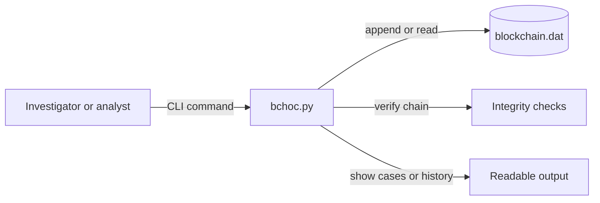

# BCHOC - Blockchain Chain of Custody

This project packages a blockchain-inspired chain-of-custody system for digital evidence handling. It focuses on the security properties that matter in forensic workflows: append-only records, integrity verification, encrypted identifiers, and controlled state transitions for evidence items.

## Why this matters

- Chain of custody is an integrity and accountability problem, not just a storage problem
- Evidence handling systems need a clear audit trail for adds, check-ins, checkouts, removals, and verification
- This project is a good secure-systems example because it turns those rules into explicit CLI operations

## Overview

BCHOC stores evidence events in a binary append-only ledger and verifies that the chain has not been altered. Each action appends a record instead of mutating previous history, which makes the workflow easier to audit and reason about.

## Architecture



## How it works

1. Evidence actions are written to a single append-only ledger file
2. Case IDs and item IDs are stored as encrypted identifiers
3. Verification logic walks the ledger and validates chain integrity and state transitions
4. Users interact through CLI commands for initialization, evidence lifecycle changes, history, and verification

## Tools used

- Python 3
- `pycryptodome`
- CLI-based workflow design
- Binary file parsing and integrity verification

## Setup

### Prerequisites

- Python 3.x
- `pycryptodome`

### Install dependency

```sh
pip install pycryptodome
```

### Example environment variables

```sh
export BCHOC_PASSWORD_OWNER="ownerpass"
export BCHOC_PASSWORD_CREATOR="C67C"
export BCHOC_PASSWORD_ANALYST="A65A"
export BCHOC_PASSWORD_POLICE="P80P"
```

## Core commands

```sh
python3 bchoc.py init
python3 bchoc.py add -c <case_uuid> -i <item_id> [-i <item_id> ...] -g <creator> -p <password>
python3 bchoc.py checkout -i <item_id> -p <password>
python3 bchoc.py checkin -i <item_id> -p <password>
python3 bchoc.py remove -i <item_id> -y <reason> [-o <owner>] -p <password>
python3 bchoc.py show cases
python3 bchoc.py show items -c <case_uuid>
python3 bchoc.py show history [-c <case_uuid>] [-i <item_id>] [-n <num_entries>] [-r] -p <password>
python3 bchoc.py summary -c <case_uuid>
python3 bchoc.py verify
```

## What I built

- Public packaging of the BCHOC project so the secure-systems story is readable outside the course context
- Evidence lifecycle workflow coverage for add, checkout, checkin, remove, history, summary, and verification operations
- A README that emphasizes auditability, integrity, and evidence-handling rules instead of generic course framing

## Lessons learned

- Security-sensitive systems benefit from append-only history because it makes tampering more obvious
- CLI design still needs to communicate role boundaries and safe operational paths clearly
- Public packaging matters: a strong project can be overlooked if it still looks like a course bucket instead of a security artifact
