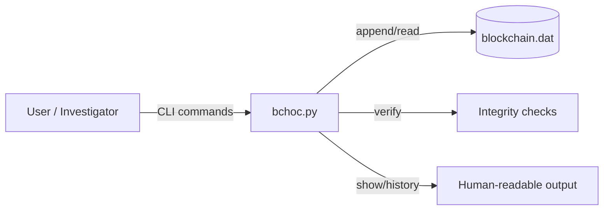

# BCHOC - Chain of Custody Ledger (Python CLI)

A **blockchain-inspired, append-only** chain-of-custody ledger for tracking digital evidence events (add, check-in/out, removal) with **integrity verification** and **encrypted identifiers**.

> Portfolio note: this project is built as an academic forensics/security system prototype, focused on correctness, tamper-evidence, and a clean CLI UX.

---

## Highlights

- **Append-only binary ledger** (tamper-evident record of evidence handling)
- **Integrity verification** to detect mutation, reordering, or broken linkage
- **Encryption of sensitive identifiers** using `pycryptodome`
- **Automated test script** included (`test_bchoc.sh`)
- Clear CLI flows for common custody actions

---

## Demo (recommended)
Add a short GIF here (30-60s): `init -> add -> checkout -> history -> verify`

---

## How it works (high level)

1. Each action (e.g., *ADD*, *CHECKOUT*, *CHECKIN*, *REMOVE*) becomes a new record appended to a single on-disk ledger.
2. Records include metadata (timestamp, case/item IDs, state transitions, etc.).
3. A verification routine walks the ledger to confirm consistency and integrity.

---

## Architecture

Quick start
Requirements

Python 3.x

pycryptodome

pip install pycryptodome

Run
python3 bchoc.py init
python3 bchoc.py add -c <case_uuid> -i <item_id> -g <creator> -p <password>
python3 bchoc.py checkout -i <item_id> -p <password>
python3 bchoc.py checkin  -i <item_id> -p <password>
python3 bchoc.py show history -i <item_id> -p <password>
python3 bchoc.py verify

Commands supported

init

add

checkout

checkin

remove

show cases

show items

show history

verify

(See README examples below for typical usage patterns.)

Developer notes (what this project demonstrates)

This repo showcases:

Binary file I/O + deterministic record parsing

CLI design and argument handling

Applied cryptography integration (pycryptodome)

Defensive validation + integrity verification logic

Test automation + repeatable workflows

Testing

A test script is included:

bash test_bchoc.sh

Hex inspection (optional)

If you want to view the raw binary ledger:

xxd blockchain.dat | less
# or
hexdump -C blockchain.dat | less

Roadmap (portfolio-friendly improvements)

If productionizing:

Replace ECB-style patterns with an authenticated mode (e.g., AES-GCM)

Add explicit key-derivation (KDF) + per-record nonce/IV design

Add structured logging + JSON output mode for integrations

Add CI (GitHub Actions) to run tests on every push

Team / Contributions

Built in a team setting. If you want to make this recruiter-friendly, list your contributions explicitly here:

My contributions: <e.g., ledger parsing, verify logic, CLI UX, tests, crypto integration>

Teammates: <names>
