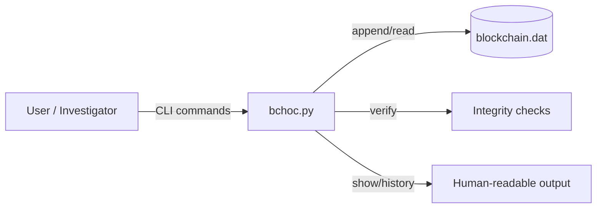

# BCHOC - Blockchain Chain of Custody (Python CLI)
A **blockchain-inspired, append-only** chain-of-custody ledger for tracking digital evidence events (add, check-in/out, removal) with **integrity verification** and **encrypted identifiers**.

## Overview

BCHOC is a blockchain-inspired, append-only chain-of-custody ledger for tracking digital evidence events. Each action (add, checkin, checkout, remove) appends a binary record to a single ledger file, and integrity checks verify that the chain has not been altered.
## Architecture




## How it works

1. The ledger is a binary file where each block stores metadata, state, and a previous-hash link.
2. Case IDs (UUIDs) and item IDs (4-byte integers) are encrypted with AES-ECB before storage.
3. The `verify` command walks the ledger and validates hashes and state transitions.

## Requirements

- Python 3.x
- `pycryptodome`

```sh
pip install pycryptodome
```

## Environment variables

- `BCHOC_FILE_PATH` (optional): path to the binary ledger file.
- `BCHOC_PASSWORD_POLICE` (default `P80P`)
- `BCHOC_PASSWORD_ANALYST` (default `A65A`)
- `BCHOC_PASSWORD_EXECUTIVE` (default `E69E`)
- `BCHOC_PASSWORD_LAWYER` (default `L76L`)
- `BCHOC_PASSWORD_CREATOR` (default `C67C`)

## Commands

```sh
python3 bchoc.py init
python3 bchoc.py add -c <case_uuid> -i <item_id> [-i <item_id> ...] -g <creator> -p <password>
python3 bchoc.py checkout -i <item_id> -p <password>
python3 bchoc.py checkin -i <item_id> -p <password>
python3 bchoc.py remove -i <item_id> -y <reason> [-o <owner>] -p <password>
python3 bchoc.py show cases
python3 bchoc.py show items -c <case_uuid>
python3 bchoc.py show history [-c <case_uuid>] [-i <item_id>] [-n <num_entries>] [-r] -p <password>
python3 bchoc.py summary -c <case_uuid>
python3 bchoc.py verify
```
